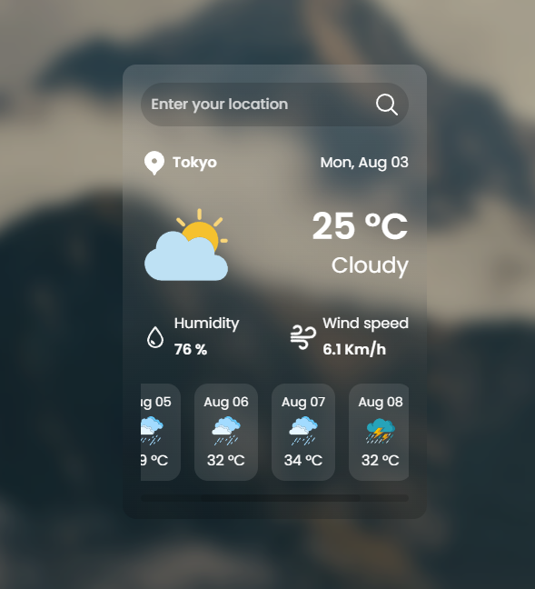

# 📝 Forecast Weather App

Приложение "Forecast Weather App", разработанное на HTML, CSS и JavaScript.

## 🖼️ Дизайн

За основу интерфейса был взят дизайн из учебного видео на YouTube.



## ⚙️ Возможности

- ✅️ Поиск города
- ✅ Получение данных о текущей погоде
- ✅ Просмотр информации о температуре, погодных условиях, влажности и скорости ветра
- ✅ Просмотр прогноза на 7 дней

## 🛠️ Технологии

- **HTML5**
- **CSS3**
- **JavaScript (ES6+)**
- **Accessibility**
- **BEM**
- **Open-Meteo API**

## 🎯 Цель проекта

Проект был разработан для практики клиент-серверного взаимодействия:

- получение данных с API
- обработка ответа с сервера
- отображение информации в пользовательском интерфейсе приложения

## 🚀 Запуск

1. 🔗 [Открыть сайт](https://daniltyrtychnyi.github.io/forecast-weather-app/)

2. Клонировать репозиторий:
```bash
git clone git@github.com:daniltyrtychnyi/forecast-weather-app/
```